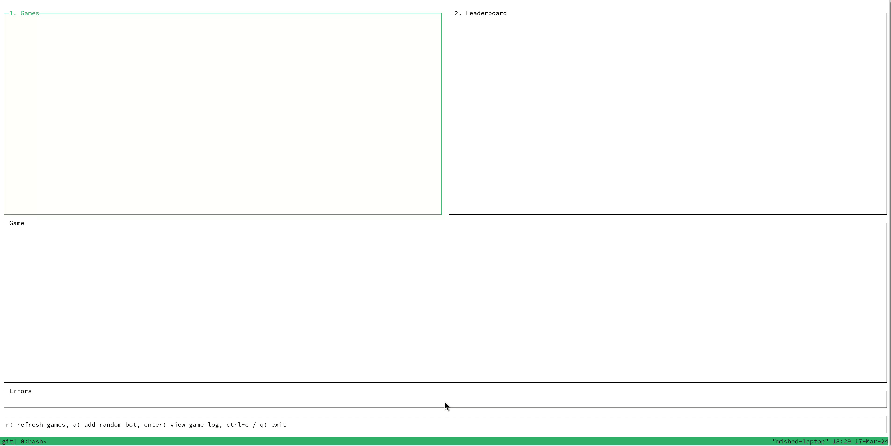

# battleship

Quick battleship game simulation project to warm up with JVM / Spring:



## Run in docker

### Build images

```sh
./bin/build-docker-builder.sh
docker compose build
```

### Start services

```sh
docker compose up battleship-server battleship-bot-go -d
```

### Run CLI in docker

```sh
docker run -it --network host battleship-cli /bin/bash
```

## Run locally

### Dependencies

Check builder [Dockerfile](./Dockerfile) for up-to-date list of dependencies.

### Build

```sh
./bin/build.sh
```

### Run server

```sh
./gradlew bootRun
```

### Run go bot

```sh
go run ./battleship-bot-go
```

### Run CLI

```sh
go run ./battleship-cli
```
